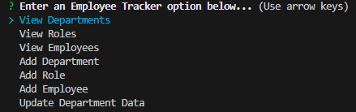

# Employee_Tracker
## Description

Employee Tracker Project is terminal-based Inquiry prompter. Users can view the business_db to track departments, roles, and employees. 

## Installation
Download the repository on your machine and ensure MySQL is installed alongside a running MySQL server.

## Usage
After running node index.js inside an integrated terminal or command line, the user will be given a series of prompts. These prompts are categorized by what action they wish to take upon which tables. Users can View, Add to, or Update data in either the Departments, Roles, or Employees tables.

Note: after completing an action, the terminal may get "stuck" displaying the results. In this case, simply pressing the up key or down key will reveal the main menu prompts again.

## Screencap
Below is what the user will initially see upon starting the program.

